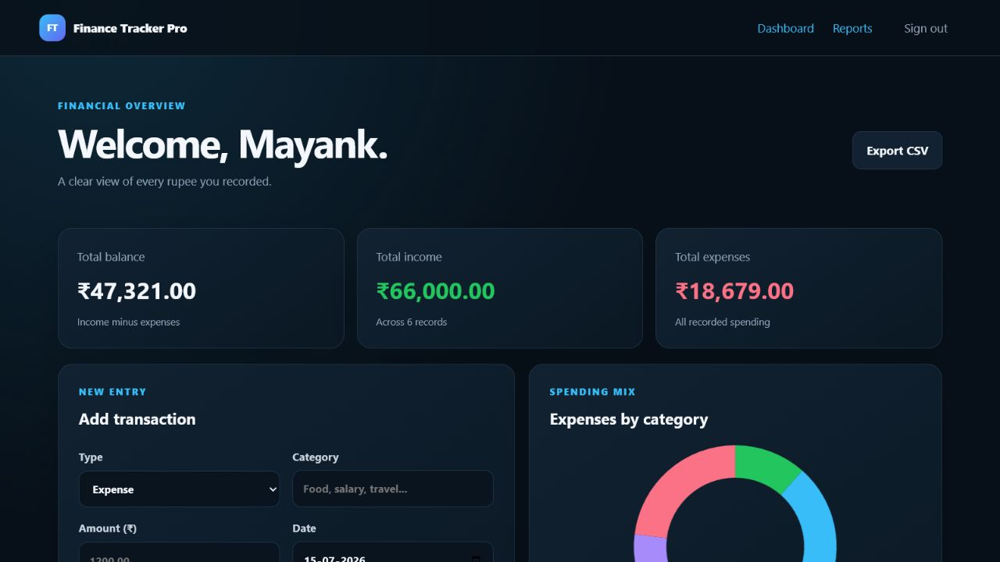
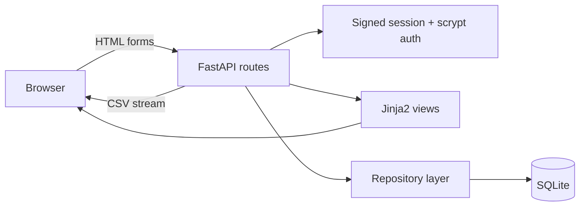

# Finance Tracker Pro

> A privacy-first personal finance dashboard for tracking income, expenses, category trends, and monthly reports without sending financial data to a third-party service.

[](https://github.com/mayanksingh-GIT-CODER/finance-tracker-pro/actions/workflows/ci.yml)
[](https://www.python.org/)
[](https://fastapi.tiangolo.com/)
[](LICENSE)



## Why this project exists

Most beginner expense trackers stop at CRUD. Finance Tracker Pro adds the engineering pieces that make a small application trustworthy: account isolation, hardened password storage, precise currency arithmetic, useful reporting, automated tests, CI, containerization, and honest documentation.

## Features

- Account registration and sign-in with scrypt password hashing
- Signed, HTTP-only session cookies
- Strict per-user transaction isolation
- Income and expense tracking with categories, dates, and notes
- Dashboard totals and expense-category chart
- Filterable monthly reports
- CSV export for all records or one month
- Responsive desktop/mobile interface
- SQLite persistence with foreign keys and indexed queries
- Health endpoint for deployment monitoring
- Automated tests, linting, GitHub Actions, Docker, and Compose

## Architecture



The application deliberately uses a small layered architecture: HTTP handling stays in `app/main.py`, security primitives live in `app/security.py`, and all SQL access is isolated in `app/database.py`. See [the architecture notes](docs/architecture.md) for request flows and trade-offs.

## Tech stack

| Layer | Technology |
|---|---|
| Web | FastAPI, Starlette, Uvicorn |
| UI | Jinja2, responsive CSS, Chart.js |
| Data | SQLite, integer-cents currency storage |
| Security | `hashlib.scrypt`, signed HTTP-only cookies |
| Quality | Pytest, Ruff, GitHub Actions |
| Delivery | Docker, Docker Compose |

## Quick start

### Local Python

```bash
git clone https://github.com/mayanksingh-GIT-CODER/finance-tracker-pro.git
cd finance-tracker-pro
python -m venv .venv
```

Activate the environment:

```bash
# Windows
.venv\Scripts\activate

# macOS/Linux
source .venv/bin/activate
```

Install and run:

```bash
pip install -r requirements.txt
copy .env.example .env  # Windows; use `cp` on macOS/Linux
uvicorn app.main:app --reload
```

Open [http://127.0.0.1:8000](http://127.0.0.1:8000).

To load an optional local demonstration account:

```bash
python -m scripts.seed_demo
```

Then sign in with `demo@example.com` / `demo-pass-123`. The generated database is ignored by Git.

### Docker

```bash
docker compose up --build
```

## Usage

1. Create an account using a password of at least eight characters.
2. Add income and expense transactions from the dashboard.
3. Review totals and category distribution immediately.
4. Open **Reports** and select a month.
5. Export clean CSV records for spreadsheets or further analysis.

## Repository structure

```text
finance-tracker-pro/
├── .github/workflows/ci.yml
├── app/
│   ├── static/styles.css
│   ├── templates/
│   ├── database.py
│   ├── main.py
│   └── security.py
├── assets/dashboard.png
├── docs/architecture.md
├── tests/test_app.py
├── .env.example
├── Dockerfile
├── docker-compose.yml
├── pyproject.toml
└── requirements.txt
```

## Testing and quality

```bash
pip install -r requirements-dev.txt
ruff check .
pytest
```

The test suite covers password hashing, decimal currency conversion, registration/session behavior, dashboard/report/export integration, health monitoring, and cross-account deletion protection.

## Security and limitations

- Passwords are never stored directly; each uses a unique salt and scrypt hash.
- Currency is stored as integer cents to prevent binary floating-point errors.
- Every transaction query includes the authenticated user ID.
- `.env` and local databases are excluded from Git.
- This portfolio release does not yet include CSRF tokens, password recovery, email verification, rate limiting, or PostgreSQL migrations. Add those before operating it as a public multi-user service.
- Chart.js is loaded from a CDN; the ledger and reports remain usable if it is unavailable.

## Roadmap

- [ ] Recurring transactions and budgets
- [ ] PostgreSQL production adapter and migrations
- [ ] CSRF protection and rate limiting
- [ ] PDF monthly statement generation
- [ ] Spending forecasts with transparent evaluation metrics
- [ ] Optional React or mobile client

## Contributing

Issues and focused pull requests are welcome. Read [CONTRIBUTING.md](CONTRIBUTING.md) before starting.

## License

Released under the [MIT License](LICENSE).

## Author

**Mayank Singh** · [GitHub](https://github.com/mayanksingh-GIT-CODER) · [Email](mailto:mayanksingh.mie@gmail.com)
