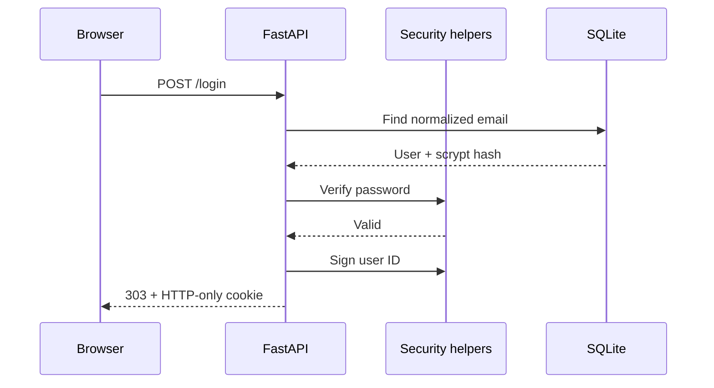

# Architecture notes

## Design goals

Finance Tracker Pro is intentionally small enough to understand in one sitting while still showing production-minded boundaries:

1. HTTP routes translate browser input into validated application operations.
2. The database layer owns schema creation and parameterized SQL.
3. Security helpers own password hashing and signed-session parsing.
4. Templates render server-authoritative data and never query storage directly.

## Authentication sequence

## Transaction isolation

All reads, deletes, reports, and exports are scoped by `user_id`. A transaction ID alone is never sufficient to mutate a record. The test suite explicitly verifies that one user cannot delete another user's transaction.

## Data decisions

- **Integer cents:** avoids floating-point rounding errors.
- **ISO dates:** sort correctly as SQLite text and remain portable.
- **SQLite:** keeps the project runnable with no infrastructure; PostgreSQL is the intended production evolution.
- **Parameterized SQL:** prevents values from becoming executable SQL.

## Deployment notes

Set a strong `SECRET_KEY`, mount persistent storage for `/app/data`, terminate TLS at a reverse proxy or managed platform, and add CSRF/rate-limit controls before exposing registration publicly.
